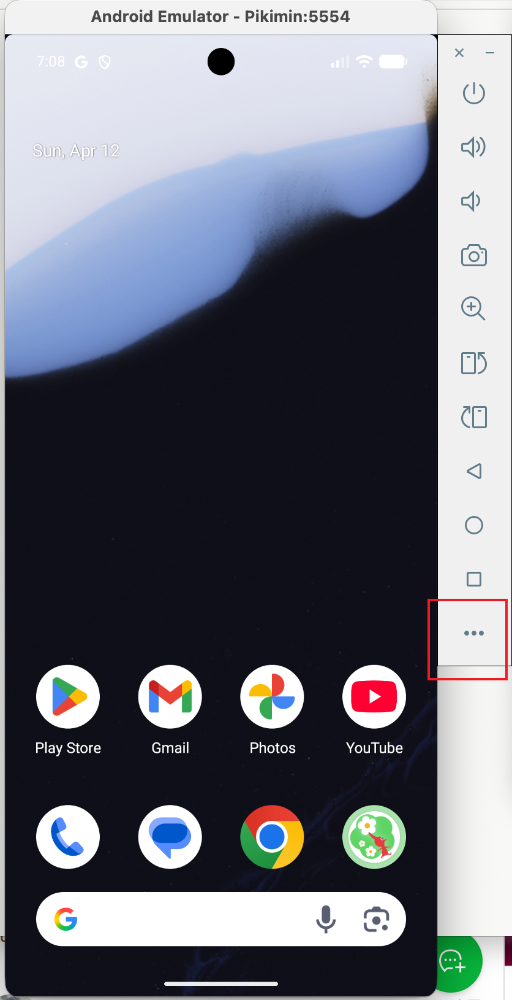
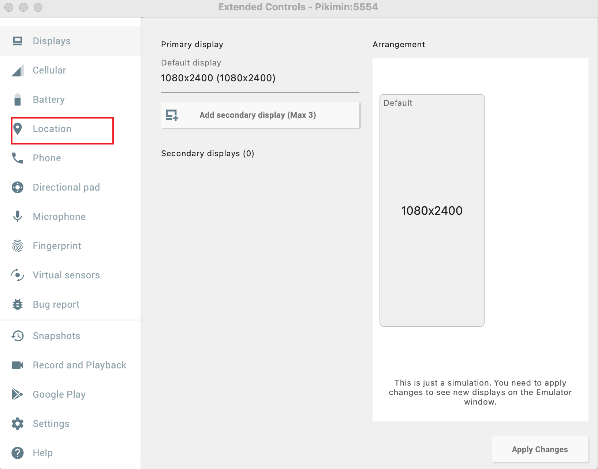
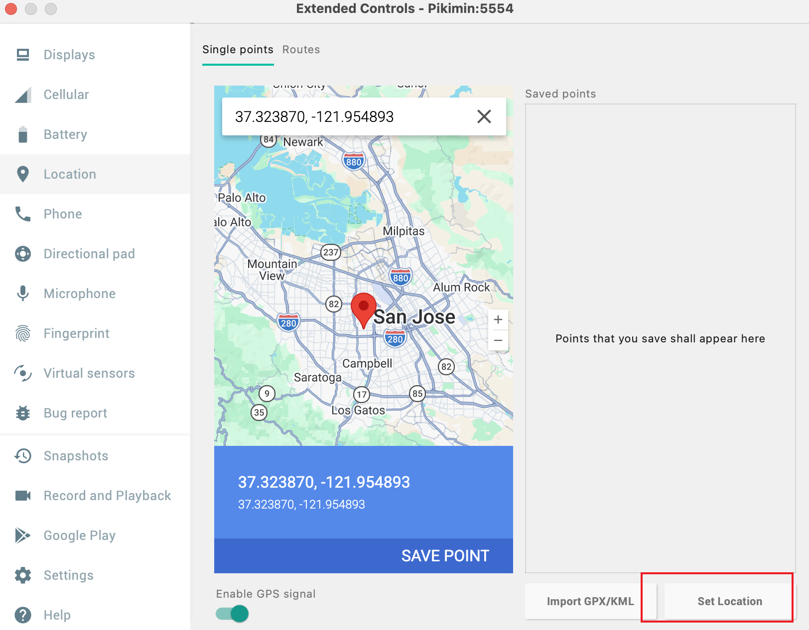
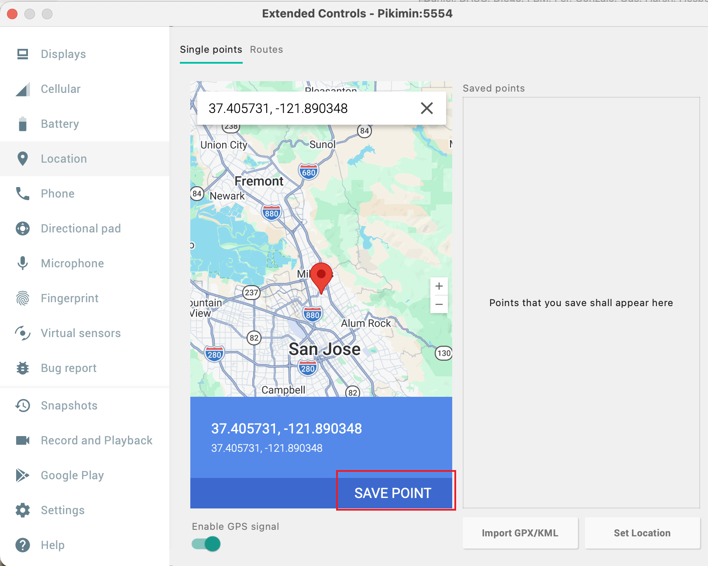

# Pikimin

[繁體中文](README_CN.md)

A macOS app that wraps the Android emulator for Pikmin Bloom walk simulation. Install the app, point it at your Android SDK, and start walking — no Android Studio knowledge required.

**Apple Silicon (M1+) only. macOS 14 Sonoma or later.**

## What it does

- Detects your existing Android SDK installation (Android Studio or Homebrew)
- Creates and manages an Android emulator (Pixel 7, Play Store enabled)
- Simulates realistic walking with GPS movement and step detection sensors
- Live dashboard showing step count, progress, GPS coordinates, and walk log

## Install

### 1. Install Android SDK

**Option A: Android Studio (recommended)**

Download from [developer.android.com/studio](https://developer.android.com/studio). Open it once to complete setup, then install a system image via SDK Manager:
- SDK Platforms > Android 16.0 (Baklava) or Android 15.0 (API 35)
- Make sure "Google Play ARM 64 v8a System Image" is checked

**Option B: Homebrew**

```bash
brew install --cask android-commandlinetools
sdkmanager "platform-tools" "emulator" \
  "system-images;android-36.0-Baklava;google_apis_playstore;arm64-v8a"
```

### 2. Install Pikimin

Download `Pikimin.dmg` from [Releases](https://github.com/hsuanchenlin/pikimin/releases), open it, and drag `Pikimin.app` to Applications.

Since the app is ad-hoc signed (not from the App Store), macOS will block it on first launch. To allow it:

1. Double-click `Pikimin.app` — macOS will show a warning that it can't be opened
2. Go to **System Settings > Privacy & Security**
3. Scroll down to the **Security** section — you'll see a message about Pikimin being blocked
4. Click **Open Anyway**
5. Confirm in the dialog that appears

### 3. Use

> **Important:** Log out of Pikmin Bloom on your phone before logging in on the emulator. It is unknown what happens if multiple devices are logged in simultaneously — to be safe, only use one device at a time.

1. Open Pikimin — it detects your SDK automatically
2. Click **Start Emulator** — wait for it to boot
3. In the emulator, open Play Store and install Pikmin Bloom
4. Log in with your Pikmin Bloom account
5. Set a GPS location (see below)
6. Click **Start Walk** — watch the steps roll in

### Setting GPS Location

Before starting a walk, you need to set a starting location in the emulator:

**Step 1.** Click the **`...`** (three dots) button on the emulator toolbar to open Extended Controls



**Step 2.** Click **Location** in the left sidebar



**Step 3.** Enter latitude and longitude (or click on the map), then click **Set Location**



**Tip:** You can click **SAVE POINT** to save frequently used locations for quick access later.



The walk simulation will read this location as the starting point and walk outward from it, then return in the second half.

## Features

- **SDK Detection** — automatically finds Android SDK at `~/Library/Android/sdk` (Android Studio) or `/opt/homebrew/share/android-commandlinetools` (Homebrew)
- **Emulator Management** — start/stop with one click, auto-detects already-running emulators
- **Walk Simulation** — configurable step count, realistic gait cycle (accelerometer + gyroscope), random GPS movement with return-to-home
- **Live Dashboard** — real-time step count, progress bar, phase indicator, GPS coordinates, elapsed time
- **Walk Log** — timestamped entries every 50 steps
- **Text Input Helper** — send text to the emulator for fields that don't accept keyboard input (e.g. Pikmin Bloom's date of birth)
- **DNS Fix** — emulator launches with `-dns-server 8.8.8.8` to avoid connectivity issues

## Build from source

```bash
cd Pikimin
swift build
./scripts/dev-run.sh    # build + launch as .app bundle
./scripts/create-dmg.sh # build release DMG
```

## How the walk simulation works

Each step cycle (~500ms) sends 7 sensor updates via `adb emu sensor set`:

1. **Swing** — Z-axis drops below gravity
2. **Heel strike** — Z-axis spike to 22 m/s² (the key trigger for step detection)
3. **Peak impact** — Z-axis at 25 m/s²
4. **Settling** — deceleration back toward gravity
5. **Midstance** — gravity baseline (step detector needs this valley)
6. **Toe off** — smaller secondary spike
7. **Rest** — return to 9.8 m/s²

GPS coordinates update each step (~1.5m per step) following a random walk pattern that returns to the starting point in the second half.

## License

MIT
