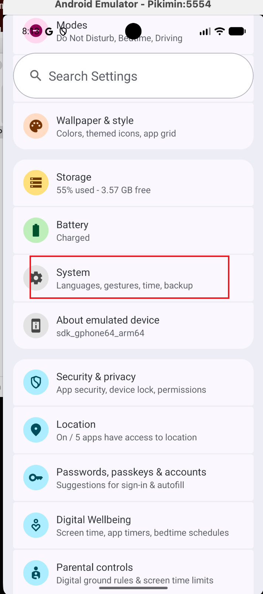
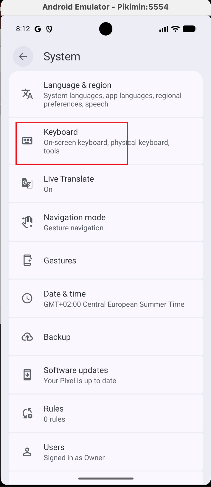
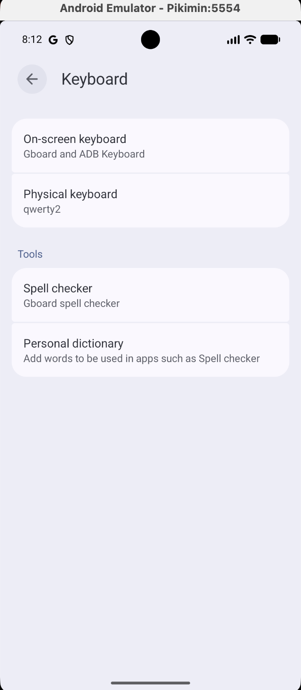

# Pikimin

一款 macOS 應用程式，封裝 Android 模擬器用於 Pikmin Bloom 自動行走模擬。安裝應用程式，指向你的 Android SDK，即可開始刷步數——無需了解 Android Studio。

**僅支援 Apple Silicon (M1+)。需要 macOS 14 Sonoma 或更高版本。**

## 功能

- 自動偵測已安裝的 Android SDK（Android Studio 或 Homebrew）
- 建立和管理 Android 模擬器（Pixel 7，支援 Play Store）
- 模擬真實行走，包含 GPS 移動和步數感測器偵測
- 即時儀表板顯示步數、進度、GPS 座標和行走日誌

## 安裝

### 1. 安裝 Android SDK

**方式 A：Android Studio（推薦）**

從 [developer.android.com/studio](https://developer.android.com/studio) 下載安裝。開啟一次完成初始設定，然後透過 SDK Manager 安裝系統映像：
- SDK Platforms > Android 16.0 (Baklava) 或 Android 15.0 (API 35)
- 確保勾選 "Google Play ARM 64 v8a System Image"

**方式 B：Homebrew**

```bash
brew install --cask android-commandlinetools
sdkmanager "platform-tools" "emulator" \
  "system-images;android-36.0-Baklava;google_apis_playstore;arm64-v8a"
```

### 2. 安裝 Pikimin

從 [Releases](https://github.com/hsuanchenlin/pikimin/releases) 下載 `Pikimin.dmg`，開啟後 **將 `Pikimin.app` 拖入「應用程式」資料夾**。這很重要——如果直接從 DMG 執行應用程式，退出磁碟映像後應用程式會消失。請務必先複製到「應用程式」資料夾。

由於應用程式使用 ad-hoc 簽署（非 App Store 來源），macOS 會在首次啟動時阻擋。允許方式如下：

1. 雙擊 `Pikimin.app` — macOS 會顯示無法開啟的警告
2. 前往 **系統設定 > 隱私權與安全性**
3. 向下捲動到 **安全性** 區塊 — 你會看到 Pikimin 被阻擋的訊息
4. 點擊 **強制打開**
5. 在彈出的對話框中確認

### 3. 使用

> **重要提醒：** 在模擬器上登入 Pikmin Bloom 之前，請先在手機上登出帳號。目前不確定同時在多台裝置上登入會發生什麼情況——為安全起見，請一次只使用一台裝置。

1. 開啟 Pikimin — 自動偵測你的 SDK
2. 點擊 **Start Emulator** — 等待模擬器啟動
3. 在模擬器中開啟 Play Store，安裝 Pikmin Bloom
4. 登入你的 Pikmin Bloom 帳號
5. 設定 GPS 位置（見下方說明）
6. 點擊 **Start Walk** — 開始刷步數

### 設定 GPS 位置

開始行走前，需要在模擬器中設定起始位置：

**步驟 1：** 點擊模擬器工具列上的 **`...`**（三個點）按鈕，開啟 Extended Controls


**步驟 2：** 點擊左側邊欄的 **Location**


**步驟 3：** 輸入經緯度（或在地圖上點擊），然後點擊 **Set Location**


**提示：** 你可以點擊 **SAVE POINT** 儲存常用位置，方便日後快速使用。


行走模擬會以此位置為起點向外行走，後半程返回起點。

### 出生日期輸入問題

Pikmin Bloom 的出生日期欄位使用了自訂鍵盤。標準鍵盤（實體鍵盤和螢幕鍵盤）在此畫面都無法使用——你會看到一個黑色/不可見的鍵盤。


解決方法：先在模擬器設定中停用 ADB Keyboard：

**步驟 1：** 在模擬器中開啟 **設定 > System（系統）**



**步驟 2：** 進入 **Keyboard（鍵盤）**



**步驟 3：** 點擊 **On-screen keyboard（螢幕鍵盤）**



**步驟 4：** 關閉 **ADB Keyboard**（保持 Gboard 開啟）


然後回到 Pikmin Bloom：
1. 點擊日期欄位 — 數字鍵盤應該會出現
2. 在 Pikimin 控制面板的 **「Type into emulator」** 欄位中輸入日期數字（例如 `01011990` 代表 01/01/1990）
3. 點擊 **Send**

## 功能列表

- **SDK 偵測** — 自動尋找 `~/Library/Android/sdk`（Android Studio）或 `/opt/homebrew/share/android-commandlinetools`（Homebrew）中的 Android SDK
- **模擬器管理** — 一鍵啟動/停止，自動偵測已執行的模擬器
- **行走模擬** — 可設定步數，真實步態週期（加速度計 + 陀螺儀），隨機 GPS 移動並自動返回
- **即時儀表板** — 即時步數、進度條、行走階段、GPS 座標、已用時間
- **行走日誌** — 每 50 步記錄一條帶時間戳的日誌
- **文字輸入助手** — 向模擬器傳送文字，用於不接受鍵盤輸入的欄位（如 Pikmin Bloom 的出生日期）
- **DNS 修復** — 模擬器啟動時使用 `-dns-server 8.8.8.8` 避免網路連線問題

## 從原始碼建置

```bash
cd Pikimin
swift build
./scripts/dev-run.sh    # 建置並以 .app 套件啟動
./scripts/create-dmg.sh # 建置發行版 DMG
```

## 行走模擬原理

每個步態週期（約 500ms）透過 `adb emu sensor set` 傳送 7 次感測器更新：

1. **擺動** — Z 軸降至重力以下
2. **腳跟著地** — Z 軸飆升至 22 m/s²（步數偵測的關鍵觸發點）
3. **衝擊峰值** — Z 軸達到 25 m/s²
4. **緩衝** — 減速回到重力附近
5. **站立中期** — 重力基線（步數偵測器需要這個低谷）
6. **腳尖蹬地** — 較小的二次峰值
7. **靜止** — 回到 9.8 m/s²

GPS 座標每步更新一次（約 1.5m/步），按隨機行走模式移動，後半程返回起點。

## 授權條款

MIT
